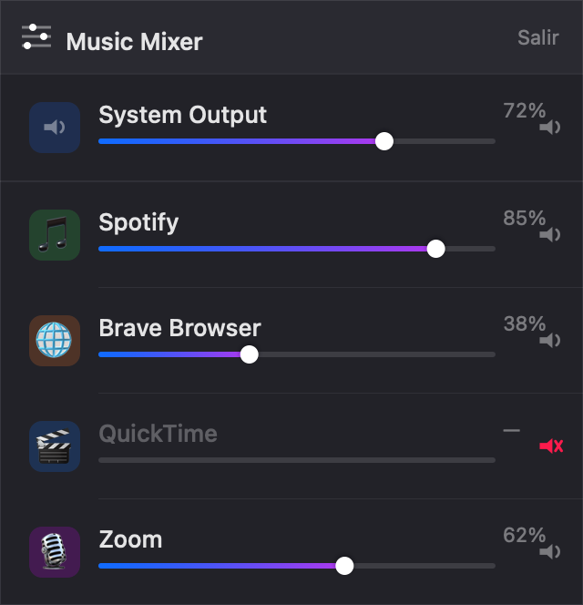

# Music Mixer

A macOS menu bar app that gives you a per-application volume mixer — the one feature Windows has always had that macOS doesn't.



## Features

- **Independent volume control per app** — lower Spotify without touching your browser
- **Mute any app** with a single click, without affecting others
- **Master system volume** slider at the top
- **Persistent state** — volume levels are remembered across launches, per app
- **Live updates** — apps appear/disappear automatically as they start or stop playing audio
- **No Dock icon** — lives quietly in the menu bar

## Requirements

- macOS 14.4 (Sonoma) or later
- Microphone & audio capture permission (requested on first launch)

> **Why 14.4?** Music Mixer uses `AudioHardwareCreateProcessTap`, a CoreAudio API that Apple added in macOS 14.4. This is what enables truly independent per-app volume — earlier approaches could only adjust the shared output device, which affected all apps at once.

## How it works

macOS 14.4 introduced **process taps** in CoreAudio. For each app playing audio, Music Mixer:

1. Creates a process tap that captures that app's audio stream
2. Silences the app's direct output
3. Re-emits the captured audio through the system output device, scaled by the slider value

This means each slider controls a gain multiplier on a private audio path — completely independent of every other app.

## Install

Download the latest `Music-Mixer-x.y.dmg` from the [Releases](../../releases) page, open it, and drag **Music Mixer** into your Applications folder.

> **First launch — Gatekeeper**
> The app is ad-hoc signed but not notarized by Apple, so macOS will refuse to open it the first time ("Apple could not verify Music Mixer is free of malware"). To open it anyway:
> - **Right-click** the app → **Open** → **Open** in the dialog, **or**
> - run `xattr -dr com.apple.quarantine "/Applications/Music Mixer.app"` once.
>
> You only need to do this once. This is expected for any open-source app distributed outside the App Store without a paid Apple Developer certificate.

## Build from source

```bash
# Clone the repo
git clone https://github.com/richardogcc/Music-Mixer.git
cd Music-Mixer

# Build and assemble the .app bundle
./scripts/build_app.sh

# Launch
open "build/Music Mixer.app"
```

The app icon is regenerated with `swift scripts/make_icon.swift` (Swift + CoreGraphics, no dependencies). The `.icns` is committed to the repo so you don't need to regenerate it unless you change the icon.

### Package a release

```bash
./scripts/release.sh
```

Builds the app, produces `dist/Music-Mixer-<version>.dmg` — a drag-to-Applications installer — and creates the GitHub release with notes from the `CHANGELOG.md` entry. The version is read from the `VERSION` file.

## Project structure

```
Sources/MusicMixer/
├── main.swift                     # NSApp entry point
├── AppDelegate.swift              # NSStatusItem + NSPopover
├── Audio/
│   ├── AudioProcess.swift         # Observable model: name, icon, volume, muted
│   ├── AudioProcessManager.swift  # Enumerates processes, owns tap controllers
│   ├── ProcessTapController.swift # CoreAudio process tap + aggregate device per app
│   ├── MasterVolumeManager.swift  # System output volume
│   └── VolumeStore.swift          # UserDefaults persistence (keyed by bundle ID)
└── Views/
    ├── PopoverContentView.swift   # Root layout
    ├── MasterVolumeRow.swift      # System volume row
    └── AppVolumeRow.swift         # Per-app row: icon + name + slider + mute
```

## Permissions

On first launch macOS will ask for **Screen Recording & System Audio** permission. This is required for process taps to capture audio. Without it the app silences each app's direct output but has nothing to re-emit — resulting in silence.

Grant it at: **System Settings → Privacy & Security → Screen Recording & System Audio**

## License

[MIT](LICENSE) © richardogcc
